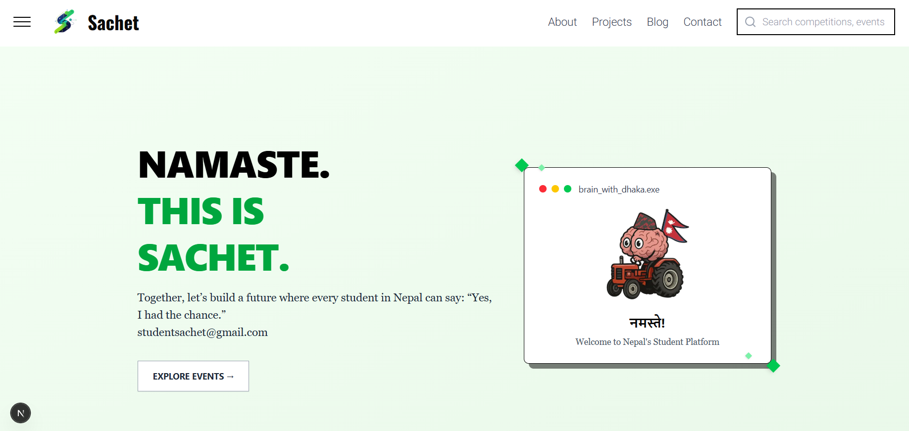

<h1 className="text-3xl md:text-4xl font-bold font-sans" align="center">Sachet</h1>
<div align="center">

[](Collaborators.md#collaborators "Donate")

[](https://github.com/suyogprasai/sachet/commits "Commit History")
[](https://github.com/suyogprasai/sachet/pulse/monthly "Last activity")
</div>
<div align="center">
  

</div>

## Description
Sachet is a notice delivery system designed specifically for high school students in Nepal. It serves as a national forum to end the "information hell" by consolidating scattered updates from Instagram, websites, and popups into a single, accessible platform. Unlike other platforms like Edusanjal or Nepvents, Sachet leverages a locally run large language model (LLM), `mistralai/mathstral-7b-v0.1`, to fully automate the process of collecting, categorizing, and publishing event notices, eliminating the need for manual admin intervention. Whether it’s events, competitions, or opportunities, Sachet makes it easy for Nepali high schoolers to stay informed.

[](https://www.youtube.com/watch?v=ArAa0lO1NlA)


## Installation Instructions
To set up Sachet locally for development or testing, follow these steps:

1. **Clone the Repository**:
   ```bash
   git clone https://github.com/sachet-project/sachet.git
   cd sachet
   ```

2. **Install Frontend and Backend Dependencies**:
   - For the Next.js frontend and backend:
     ```bash
     npm install
     ```
   - For the Python email listener:
     ```bash
     pip install -r requirements.txt
     ```

3. **Set Up LM Studio**:
   - Download and install [LM Studio](https://lmstudio.ai/) to run the `mistralai/mathstral-7b-v0.1` model locally.
   - Load the `mistralai/mathstral-7b-v0.1` model in LM Studio and ensure it’s running on your local server.

4. **Configure Environment Variables**:
   - Create a `.env.local` file in the root directory and add the following:
     ```
     NEXT_PUBLIC_API_URL=http://localhost:3000
     EMAIL_LISTENER_ADDRESS=studentsachet@gmail.com
     LLM_API_URL=http://localhost:1234 # Default LM Studio URL
     ```
   - Configure your email listener credentials for the `studentsachet@gmail.com` inbox.

5. **Run the Application**:
   - Start the Next.js app:
     ```bash
     npm run dev
     ```
   - Start the Python email listener:
     ```bash
     python email_listener.py
     ```

6. **Access the App**:
   - Open your browser and navigate to `http://localhost:3000`.

## Usage
Sachet is designed to be intuitive for both users and organizations. Here’s how it works:

- **For Students**:
  - Browse the clean, user-friendly interface to discover events, competitions, and opportunities tailored for Nepali high schoolers.
  - Subscribe to the newsletter to receive curated notices directly in your inbox.
  - Check out special “Announcement” pop-ups for paid advertisements highlighting key opportunities.

- **For Organizations**:
  - Add `studentsachet@gmail.com` to your email lists for event announcements.
  - Sachet’s AI automatically processes incoming emails, extracts relevant details (e.g., location, deadline, time), categorizes events, and tags them for easy discovery.
  - No manual intervention is required—our system handles everything from inbox to frontend display.

## Features
- **Fully Automated Notice Publishing**: Powered by the `mistralai/mathstral-7b-v0.1` LLM, notices are extracted, categorized, and tagged without human intervention.
- **Email-Based Notice Collection**: Notices are sourced directly from emails sent to `studentsachet@gmail.com`.
- **Newsletter Subscription**: Get curated event updates delivered to your inbox.
- **Special Announcements**: Paid advertisements are displayed as prominent pop-ups for maximum visibility.
- **Simple and Readable UI**: Designed with high school students in mind, the interface is clean and easy to navigate.

### Planned Features
- **Community Forum**: Reddit-like threading system for users to reply to posts.
- **Authentication System**: Sign-in via Google or Facebook for personalized experiences.
- **Upvote/Downvote System**: Engage the community with voting to highlight popular events.

## Contributing
We welcome contributions from developers, designers, and anyone passionate about improving access to opportunities for Nepali high schoolers! To contribute:

1. **Fork the Repository**:
   - Fork the project on GitHub and clone your fork locally.

2. **Set Up the Development Environment**:
   - Follow the installation instructions above.

3. **Create a Branch**:
   ```bash
   git checkout -b feature/your-feature-name
   ```

4. **Make Changes**:
   - Work on your feature or bug fix, ensuring code quality and documentation.
   - For frontend changes, use Next.js best practices.
   - For Python email listener changes, ensure compatibility with the existing LLM pipeline.

5. **Submit a Pull Request**:
   - Push your changes to your fork and submit a pull request to the main repository.
   - Include a clear description of your changes and reference any related issues.

6. **Code Review**:
   - Be open to feedback and make necessary revisions to ensure alignment with project goals.

Please adhere to our [Code of Conduct](CODE_OF_CONDUCT.md) and ensure all contributions are well-documented.

## License
This project is licensed under the MIT License. See the [LICENSE](LICENSE) file for details.